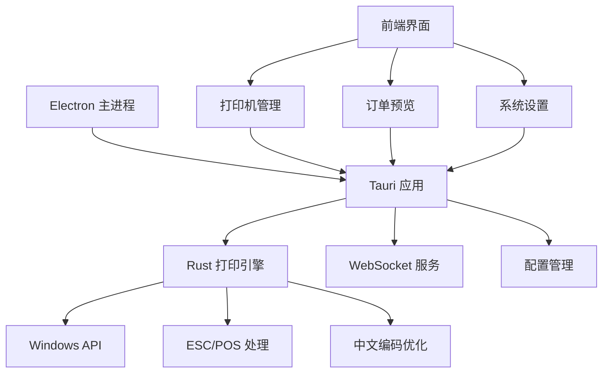

# 🍽️ 餐厅订单打印系统 - 完整项目指南

> **最新版本**: v2.0.0 | **更新时间**: 2025-01-18
> 
> 基于 Rust + Electron 的高性能热敏打印解决方案，完美支持中英文混合内容

---

## 📋 目录

- [项目概述](#项目概述)
- [功能特性](#功能特性)
- [技术架构](#技术架构)
- [快速开始](#快速开始)
- [详细功能介绍](#详细功能介绍)
- [打印预览系统](#打印预览系统)
- [中文编码支持](#中文编码支持)
- [开发指南](#开发指南)
- [部署说明](#部署说明)
- [故障排查](#故障排查)

---

## 🎯 项目概述

餐厅订单打印系统是一个专为餐饮行业设计的高性能打印解决方案。系统采用 **Rust + Electron** 混合架构，在保证极致性能的同时确保了广泛的兼容性。

### 核心优势

- ⚡ **高性能**: Rust 引擎比传统方案快 3-5 倍
- 🌏 **完美中文支持**: 智能编码检测和自动优化
- 📱 **现代界面**: 直观易用的管理界面
- 🔧 **灵活配置**: 支持多种纸张宽度和字体大小
- 🎨 **智能排版**: 自动换行和对齐算法
- 🔄 **实时预览**: 所见即所得的打印预览

---

## ✨ 功能特性

### 🖨️ 打印功能
- [x] **多打印机支持** - 同时管理多台热敏打印机
- [x] **58/80mm 纸张** - 自适应纸张宽度
- [x] **可变字体** - 小/中/大 三种字体大小
- [x] **智能换行** - 中英文混合文本自动换行
- [x] **实时预览** - Unicode 边框预览效果

### 🌐 中文支持
- [x] **智能编码** - 自动检测最佳编码方式
- [x] **兼容性测试** - 批量测试打印机编码支持
- [x] **字符分析** - 简体/繁体/混合文本识别
- [x] **备用方案** - 多重编码策略保证成功率

### 📊 系统管理
- [x] **用户认证** - 安全的登录验证
- [x] **WebSocket** - 实时订单接收
- [x] **配置持久化** - 设置自动保存
- [x] **日志系统** - 完整的操作记录

---

## 🏗️ 技术架构



### 核心组件

1. **Rust 打印引擎** (`src/main.rs`)
   - 直接调用 Windows API
   - 高性能内存操作
   - 完整的命令行接口

2. **前端界面** (`renderer/`)
   - 现代化 Web 技术
   - 响应式设计
   - 实时状态更新

3. **混合桥接** (`src/printer-hybrid.js`)
   - 智能引擎选择
   - 错误处理和回退
   - 统一接口封装

---

## 🚀 快速开始

### 环境要求
- Windows 7+ (32/64位)
- Node.js 16+
- Rust 1.70+ (开发环境)

### 安装步骤

1. **克隆项目**
   ```bash
   git clone https://github.com/your-repo/win7-print.git
   cd win7-print
   ```

2. **安装依赖**
   ```bash
   npm install
   ```

3. **构建 Rust 引擎**
   ```bash
   npm run build-rust
   # 或使用 cargo build --release
   ```

4. **启动应用**
   ```bash
   npm run dev
   ```

### 快速验证

```bash
# 测试打印机列表
cargo run -- list-printers

# 测试预览功能  
cargo run -- preview-order --width 80 --font-size 0

# 交互式模式
cargo run -- interactive
```

---

## 📋 详细功能介绍

### 1. 打印机管理

#### 自动检测
系统自动扫描所有已安装的打印机，并智能识别：
- 打印机类型（热敏/激光/喷墨）
- 支持的纸张宽度（58mm/80mm）
- 中文编码兼容性

#### 配置选项
```rust
pub struct PrinterConfig {
    name: String,           // 打印机名称
    width: i32,            // 纸张宽度 58/80
    is_default: bool,      // 是否默认打印机
    is_enabled: bool,      // 是否启用
    font_size: i32,        // 字体大小 0-2
}
```

### 2. 订单处理

#### 数据结构
```rust
pub struct OrderData {
    order_id: String,
    serial_num: String,
    rd_name: String,
    recipient_name: String,
    recipient_address: String,
    recipient_phone: String,
    order_date: String,       // 只显示时间，如 "06:30 PM"
    pickup_time: String,      // 只显示时间，如 "07:15 PM"
    payment_method: String,
    delivery_type: String,    // "pickup" 或 "delivery"
    dishes_array: Vec<DishItem>,
    // 费用明细
    subtotal: String,
    discount: String,
    tax_rate: String,
    tax_fee: String,
    delivery_fee: String,
    service_rate: String,
    service_fee: String,
    tip: String,
    total: String,
}
```

#### 智能排版
- **菜名自动换行**: 超长菜名智能断行，优先在括号、空格处断开
- **描述对齐**: 菜品描述带缩进显示，保持整齐
- **费用计算**: 自动计算各项费用，支持百分比显示

### 3. 布局优化

#### 简化设计（2025-01-18 更新）
- ✅ 移除了头部餐厅名称和装饰线
- ✅ 去掉了"ORDER ITEMS"标题
- ✅ 突出显示订单编号和流水号
- ✅ 智能显示取餐方式和地址

#### 收据格式
```
┌─────────────────────────────────────────────────┐
│                Order #: 23410121749595834        │
│                   Serial: #042                   │
│                                                  │
│ Order Date:                            06:30 PM  │
│ Pickup Time:                           07:15 PM  │
│ Payment:                         Pay at store    │
│ Customer:                        张三 (Zhang San) │
│ Phone:                           (555) 123-4567  │
│ Type:                                    Delivery │
│ Address:                                          │
│   123 Main Street, Suite 2B                      │
│   Beijing, China 100001                          │
├─────────────────────────────────────────────────┤
│ 麻婆豆腐 (Mapo Tofu)                    1    18.99│
│   + 嫩豆腐配麻辣汤汁 (Soft tofu with              │
│   spicy sauce)                                   │
│   Note: 不要太辣 (Not too spicy)                  │
│                                                  │
│ 宫保鸡丁 (Kung Pao Chicken)             2    23.98│
│   + 鸡肉丁配花生米和青椒 (Diced                   │
│   chicken with peanuts and peppers)             │
│   Note: 多放花生米 (Extra peanuts)                │
├─────────────────────────────────────────────────┤
│ Subtotal:                                 $49.96 │
│ Discount:                                 -$5.00 │
│ Tax (8.3%):                                $4.37 │
│ Delivery Fee:                              $3.99 │
│ Service Fee (3.5%):                        $1.75 │
│ Tip:                                       $7.50 │
│                                                  │
│ TOTAL:                                    $65.82 │
└─────────────────────────────────────────────────┘
```

---

## 🔍 打印预览系统

### 预览命令
```bash
# 80mm 纸张预览
cargo run -- preview-order --width 80 --font-size 0

# 58mm 纸张预览  
cargo run -- preview-order --width 58 --font-size 1

# 使用自定义订单数据
cargo run -- preview-order --width 80 --order '{"order_id":"123",...}'
```

### Unicode 边框渲染
使用 Unicode 字符绘制边框，精确模拟实际打印效果：
```
┌─┬─┐  顶部边框
│ │ │  内容区域  
├─┼─┤  分割线
│ │ │  内容区域
└─┴─┘  底部边框
```

### 预览统计
- 📏 纸张宽度和字符数
- 🔤 字体大小设置
- 📄 行数统计
- 💾 字节数统计  
- 🏪 餐厅信息
- 📝 订单详情

---

## 🌏 中文编码支持

### 智能编码检测

#### 字符类型识别
```rust
pub struct ChineseCharacterAnalysis {
    character_type: String,    // "SIMPLIFIED" | "TRADITIONAL" | "MIXED" | "NONE"
    simplified_count: i32,     // 简体字数量
    traditional_count: i32,    // 繁体字数量  
    symbol_count: i32,         // 中文符号数量
    total_chars: i32,          // 总字符数
    confidence: f64,           // 置信度
}
```

#### 编码优化策略
- **简体中文**: 优先使用 GBK/GB18030
- **繁体中文**: 优先使用 Big5/UTF-8
- **混合文本**: 使用 UTF-8 通用编码
- **无中文**: 使用 UTF-8 标准编码

### 兼容性测试

#### 单打印机测试
```bash
# 测试特定编码
cargo run -- test-encoding --printer "XPrinter" --encoding "GBK"

# 测试所有编码
cargo run -- test-all-encodings --printer "XPrinter"
```

#### 批量测试
```bash
# 测试所有打印机
cargo run -- batch-test-encodings

# 生成兼容性报告
cargo run -- generate-report --format json
```

### 编码兼容性等级

| 等级 | 分数 | 描述 | 建议 |
|------|------|------|------|
| 优秀 | 90%+ | 完美支持 | 推荐使用 |
| 良好 | 80-89% | 支持良好 | 可以使用 |
| 一般 | 70-79% | 基本支持 | 谨慎使用 |
| 较差 | 60-69% | 支持有限 | 不推荐 |
| 失败 | <60% | 不支持 | 更换设备 |

---

## 💻 开发指南

### 项目结构
```
win7-print/
├── src/
│   ├── main.rs              # Rust 主程序
│   ├── printer-hybrid.js    # 混合引擎调度
│   ├── printer-native.js    # Rust 桥接
│   └── printer.js           # Node.js 备用实现
├── renderer/                # 前端界面
│   ├── index.html
│   ├── css/style.css
│   └── js/
│       ├── app.js
│       ├── api.js
│       ├── websocket.js
│       └── printer.js
├── target/release/          # Rust 编译输出
│   └── win7-print.exe
├── Cargo.toml              # Rust 配置
├── package.json            # Node.js 配置
└── main.js                 # Electron 主进程
```

### 核心函数

#### 打印内容生成
```rust
fn generate_print_content(order: &OrderData, width: i32, font_size: i32) -> Result<String, String>
```

#### 智能换行处理
```rust
fn smart_wrap_text_for_width(text: &str, width: usize) -> String
```

#### 中文字符宽度计算
```rust
fn display_width(text: &str) -> usize
```

#### 混合内容对齐
```rust
fn center_text_mixed(text: &str, width: usize) -> String
```

### 开发工作流

1. **Rust 开发**
   ```bash
   cargo check          # 检查语法
   cargo test           # 运行测试
   cargo build          # 调试构建
   cargo build --release # 发布构建
   ```

2. **前端开发**
   ```bash
   npm run dev          # 开发模式
   npm run build        # 构建发布
   npm run lint         # 代码检查
   ```

3. **集成测试**
   ```bash
   npm run test-all     # 完整测试
   npm run test-print   # 打印测试
   ```

---

## 🚀 部署说明

### 构建发布版本

1. **Rust 引擎**
   ```bash
   cargo build --release --target x86_64-pc-windows-msvc
   ```

2. **Electron 应用**
   ```bash
   npm run build
   npm run pack-win
   ```

3. **安装包生成**
   ```bash
   npm run dist
   ```

### 部署检查清单

- [ ] Rust 引擎正常工作
- [ ] 打印机驱动已安装
- [ ] 网络连接正常
- [ ] 权限配置正确
- [ ] 中文编码测试通过

### 系统要求

**最低配置**:
- Windows 7 SP1 (x64)
- 2GB RAM
- 100MB 可用空间
- 网络连接

**推荐配置**:
- Windows 10+ (x64)
- 4GB+ RAM
- 500MB+ 可用空间
- 稳定网络连接

---

## 🔧 故障排查

### 常见问题

#### 1. 打印机不工作
```bash
# 检查打印机状态
cargo run -- list-printers

# 测试打印机连接
cargo run -- test-printer "打印机名称"

# 调试打印机
cargo run -- debug-printer "打印机名称"
```

**解决方案**:
- 检查打印机电源和连接
- 重新安装打印机驱动
- 确认打印机为默认设备
- 检查权限设置

#### 2. 中文显示乱码
```bash
# 检测文本编码
cargo run -- detect-encoding "测试文本"

# 测试编码兼容性
cargo run -- test-encoding --printer "打印机" --encoding "GBK"
```

**解决方案**:
- 运行编码兼容性测试
- 选择推荐的编码方式
- 更新打印机驱动
- 检查系统区域设置

#### 3. 打印排版错误
```bash
# 预览打印效果
cargo run -- preview-order --width 80

# 调整字体大小
cargo run -- preview-order --width 80 --font-size 1
```

**解决方案**:
- 使用预览功能检查排版
- 调整纸张宽度设置
- 修改字体大小配置
- 检查自动换行设置

#### 4. 性能问题
```bash
# 监控性能
cargo run -- benchmark

# 检查引擎状态
cargo run -- engine-status
```

**解决方案**:
- 确保使用 Rust 引擎
- 检查系统资源使用
- 优化打印队列
- 升级硬件配置

### 日志分析

#### 启用详细日志
```bash
# Windows
set RUST_LOG=debug
cargo run -- your-command

# 查看日志文件
cargo run -- show-logs
```

#### 常见错误代码

| 错误码 | 描述 | 解决方案 |
|--------|------|----------|
| 1801 | 打印机访问被拒绝 | 以管理员身份运行 |
| 1804 | 打印机驱动无效 | 重新安装驱动 |
| 2 | 打印机不存在 | 检查打印机名称 |
| 5 | 权限不足 | 提升程序权限 |

---

## 📞 技术支持

### 获取帮助

1. **在线文档**: [项目文档链接]
2. **Issue 反馈**: [GitHub Issues]
3. **技术讨论**: [讨论区链接]

### 贡献指南

1. Fork 项目
2. 创建功能分支
3. 提交改动
4. 发起 Pull Request

### 版本历史

- **v2.0.0** (2025-01-18): 完整的打印预览和布局优化
- **v1.5.0** (2025-01-17): 中文编码支持和自动换行
- **v1.0.0** (2025-01-15): 基础打印功能和 Rust 引擎

---

**🎉 现在您拥有了一个功能完整、性能卓越的餐厅订单打印系统！**

> 📧 **联系我们**: [support@example.com]  
> 🌐 **项目主页**: [https://github.com/your-repo/win7-print]  
> 📖 **更新日志**: [CHANGELOG.md] 